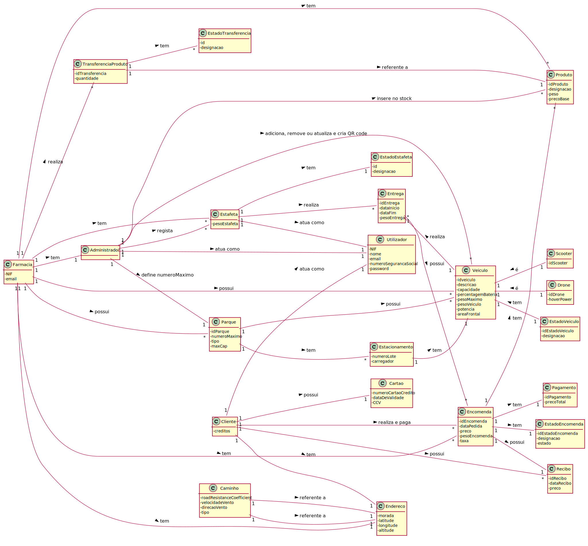

# README

## Resumo 
A nossa aplicação permite a realização de encomendas online, sendo estas feitas por clientes e também gere as entregas destas, 
sejam elas por scooter (conduzida por um estafeta) ou por drone. Os clientes poderão proceder ao pagamento das mesmas 
tanto por cartão como por um sistema de créditos que são dados ao cliente com base nas encomendas anteriormente feitas. 

Na aplicação o administrador poderá fazer a gestão de tudo relacionado com a empresa (farmácias, produtos, 
estafetas, scooters, drones, etc .) alterando o que for necessário.

## Utilizador não-registado
Um utilizador não-registado inicialmente poderá realizar o registo inserindo os seus dados e credenciais 
a utilizar no login de forma a poder usufruir das funcionalidades da aplicação.

## Cliente
Após estar registado, o cliente poderá efetuar uma encomenda na plataforma. 
Assim que entra, ser-lhe-ão apresentadas a lista de farmácias existentes na área e os produtos em 
stock de cada uma delas. A partir daí o utilizador poderá selecionar os produtos a comprar e a
 quantidade que deseja comprar deles. A partir daqui poderão acontecer três situações:

* A farmácia mais próxima do cliente tem todos os produtos necessários e apresenta a lista dos mesmos. 
O cliente poderá então decidir se irá realizar o pagamento ou não e caso sim, se irá pagar com créditos ou não. 
Após o pagamento, a entrega é gerada e com ela também um recibo que é enviado ao cliente por email. 
A entrega posteriormente ficará numa lista de encomendas a entregar.

* A farmácia mais próxima do cliente não tem todos os produtos necessários na quantidade pretendida e 
então terá de pedir a outras farmácias os itens em falta. Desta troca de itens são geradas duas notas, 
uma de transferência de uma de entrega de forma a documentar e guardar as informações relativas 
á transferência de produtos. Após todos os produtos terem sido entregues, 
o funcionamento continua tal como mostra na situação 1. 

* Nenhuma das farmácias tem todos os produtos necessários na quantidade pretendida. Neste caso 
o cliente é notificado da situação, recebendo apenas todos os produtos que existiam nas farmácias.

## Adminstrador
Um administrador poderá fazer o login na plataforma e dentro ela terá uma variedade de operações que pode realizar:
*	**Adicionar veículo** – Adiciona um veículo, seja scooter ou drone, à base de dados da plataforma.
*	**Remover veículo** – Remove um veículo, seja scooter ou drone, da base de dados da plataforma.
*	**Atualizar veículo** – Atualiza as informações de um veículo, seja scooter ou drone, na base de dados da plataforma.
*	**Registar estafeta** – Regista as informações de um estafeta na base de dados da plataforma.
*	**Atualizar estafeta** - Atualiza as informações de um estafeta na base de dados da plataforma.
*	**Adicionar item ao stock** – Adiciona ao stock de uma farmácia escolhida pelo administrador os dados relativos a um produto. 
Se o produto já existir, este irá adicionar ao stock a quantidade criada.
*	**Atualizar item** – Atualiza as informações relativas a um item de uma farmácia escolhida pelo administrador.
*	**Registar farmácia** – Regista uma farmácia na base de dados da plataforma. Ao registar a farmácia, também são 
criados os parques para essa farmácia. Estes poderão ser parques para scooters e/ou drones.

## Estafeta
O estafeta também poderá fazer o login na plataforma e no seu menu poderá iniciar uma entrega.
Ao iniciar a entrega este indica de que farmácia ele irá sair para começar a entrega e também 
quanto é o peso máximo que pode levar. O sistema com estas informações faz uma simulação com 
todos os veículos existentes e após fazer todos os cálculos necessários mostra ao estafeta os custos 
energéticos pela via terrestre e via aérea e indica qual deles é o mais eficiente. Com essa informação 
o estafeta poderá escolher um dos dois métodos e em seguida procede à realização da entrega.

## Carregamento dos veículos
Todos os veículos estacionados também podem ser carregados em estações de carregamento, 
presentes em alguns dos lotes de estacionamento. O tempo que cada um demora a carregar 
é calculado e sempre que um veículo entra num desses lotes, o cálculo é realizado e o estafeta 
é notificado por email de quando um veículo está estacionado e de 
quanto tempo este demora a ter a carga completa.

# Modelo de Domínio



# Modelo Relacional


# Casos de Uso

* [UC1 - Registar Cliente](docs/UC1/UC1.md)
* [UC2 - Registar Farmácia](docs/UC2/UC2.md)
* [UC3 - Adicionar Scooter](docs/UC3/UC3.md)
* [UC4 - Atualizar Scooter](docs/UC4/UC4.md)
* [UC5 - Remover Scooter](docs/UC5/UC5.md)
* [UC6 - Registo Entrega](docs/UC6/UC6.md)
* [UC7 - Adicionar Drone](docs/UC7/UC7.md)
* [UC8 - Remover Drone](docs/UC8/UC8.md)
* [UC9 - Notificar Estafeta](docs/UC9/UC9.md)
* [UC10 - Registar Estafeta](docs/UC10/UC10.md)
* [UC11 - Inicia Entrega](docs/UC11/UC11.md)
* [UC12 - Estaciona Veículo](docs/UC12/UC12.md)
* [UC13 - Inserir Itens Stock](docs/UC13/UC13.md)
* [UC14 - Realiza Encomenda](docs/UC14/UC14.md)
* [UC15 - Farmácia Mais Próxima Cliente](docs/UC15/UC15.md)
* [UC16 - Inserir Estacionamento](docs/UC16/UC16.md)
* [UC17 - Atualizar Estafeta](docs/UC17/UC17.md)
* [UC18 - Atualizar Item Stock](docs/UC18/UC18.md)
* [UC19 - Pedir Item Farmácia](docs/UC19/UC19.md)
* [UC20 - Notificar Cliente](docs/UC20/UC20.md)
* [UC21 - Registar Farmácia](docs/UC21/UC21.md)
* [UC22 - Enviar Nota Transferência](docs/UC22/UC22.md)
* [UC23 - Enviar Nota Entrega](docs/UC23/UC23.md)
* [UC24 - Atualizar Drone](docs/UC24/UC24.md)
* [UC25 - Entrega Eficiente](docs/UC25/UC25.md)
* [UC26 - Leitura de Dados](docs/UC26/UC26.md)

## Java source files

Java source and test files are located in folder src.

## Maven file

Pom.xml file controls the project build.

# Notes
In this file, DO NOT EDIT the following elements:

* groupID
* artifactID
* version
* properties

Beside, students can only add dependencies to the specified section of this file.

## Eclipse files

The following files are solely used by Eclipse IDE:

* .classpath
* .project

## IntelliJ Idea IDE files

The following folder is solely used by Intellij Idea IDE :

* .idea

# How was the .gitignore file generated?
.gitignore file was generated based on https://www.gitignore.io/ with the following keywords:

  - Java
  - Maven
  - Eclipse
  - NetBeans
  - Intellij

# Who do I talk to?
In case you have any problem, please email Nuno Bettencourt (nmb@isep.ipp.pt).

# How do I use Maven?

## How to run unit tests?

Execute the "test" goals.

`$ mvn test`

## How to generate the javadoc for source code?

Execute the "javadoc:javadoc" goal.

`$ mvn javadoc:javadoc`

This generates the source code javadoc in folder "target/site/apidocs/index.html".

## How to generate the javadoc for test cases code?

Execute the "javadoc:test-javadoc" goal.

`$ mvn javadoc:test-javadoc`

This generates the test cases javadoc in folder "target/site/testapidocs/index.html".

## How to generate Jacoco's Code Coverage Report?

Execute the "jacoco:report" goal.

`$ mvn test jacoco:report`

This generates a jacoco code coverage report in folder "target/site/jacoco/index.html".

## How to generate PIT Mutation Code Coverage?

Execute the "org.pitest:pitest-maven:mutationCoverage" goal.

`$ mvn test org.pitest:pitest-maven:mutationCoverage`

This generates a PIT Mutation coverage report in folder "target/pit-reports/YYYYMMDDHHMI".

## How to combine different maven goals in one step?

You can combine different maven goals in the same command. For example, to locally run your project just like on jenkins, use:

`$ mvn clean test jacoco:report org.pitest:pitest-maven:mutationCoverage`

## How to perform a faster pit mutation analysis?

Do not clean build => remove "clean"

Reuse the previous report => add "-Dsonar.pitest.mode=reuseReport"

Use more threads to perform the analysis. The number is dependent on each computer CPU => add "-Dthreads=4"

Temporarily remove timestamps from reports.

Example:

`$ mvn test jacoco:report org.pitest:pitest-maven:mutationCoverage -DhistoryInputFile=target/fasterPitMutationTesting-history.txt -DhistoryOutputFile=target/fasterPitMutationTesting-history.txt -Dsonar.pitest.mode=reuseReport -Dthreads=4 -DtimestampedReports=false`

## Where do I configure my database connection?

Each group should configure their database connection on file: 

* src/main/resources/application.properties

# Oracle repository

If you get the following error:

```
[ERROR] Failed to execute goal on project 
bike-sharing: Could not resolve dependencies for project 
lapr3:bike-sharing:jar:1.0-SNAPSHOT: 
Failed to collect dependencies at 
com.oracle.jdbc:ojdbc7:jar:12.1.0.2: 
Failed to read artifact descriptor for 
com.oracle.jdbc:ojdbc7:jar:12.1.0.2: 
Could not transfer artifact 
com.oracle.jdbc:ojdbc7:pom:12.1.0.2 
from/to maven.oracle.com (https://maven.oracle.com): 
Not authorized , ReasonPhrase:Authorization Required. 
-> [Help 1]
```

Follow these steps:

https://blogs.oracle.com/dev2dev/get-oracle-jdbc-drivers-and-ucp-from-oracle-maven-repository-without-ides

You do not need to set a proxy.

You can use existing dummy Oracle credentials available at http://bugmenot.com.